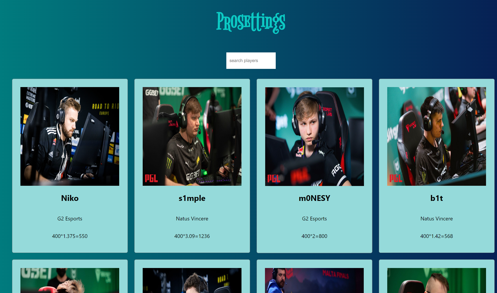

<p align="center">
  <sub>
    Built with ❤︎ by
    <a href="https://github.com/Nagi-ovo">Nagi-ovo</a>
  </sub>
</p>

<a href="https://space.bilibili.com/312249633?spm_id_from=333.337.0.0" target="_blank">
    
  </a>

# A React App that searches the game Settings of current **CS: GO Pros** through a local database

# Development

Clone this repository and  download the necessary configuration(including React and Node.js) 
You can simply run this demo by running:

```sh
npm start
```

